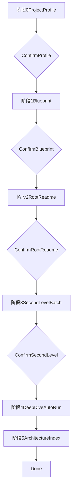

---

## name: project-docs-weave

description: 渐进式分析任意项目并按目录生成结构化 README.md 文档，沉淀为可检索的知识库原料。Use when the user wants to quickly understand a new project, bootstrap modular documentation, generate README.md files by directory, build architecture notes from code, or create a progressive project documentation workflow with staged confirmation.

# 渐进式项目文档织造

不要一次性生成一个大而全的总文档。按目录拆分，只让每个 `README.md` 解释当前目录这一层的职责、结构与约定。

## 使用时机

在以下场景使用本 skill：

- 用户刚接手一个项目，需要先建立结构化认知。
- 用户希望把源码知识沉淀成后续可复用的知识库原料。
- 用户明确要求按目录生成 `README.md`，而不是只写单份架构总览。
- 用户希望以分阶段确认的工作流推进，而不是一次性批量落盘。

不适用场景：

- 用户只想更新已有文档中的局部内容。
- 用户只需要某个函数、模块或调用链的临时说明，不需要产出目录级文档。

## 核心原则

- 每个 `README.md` 只讲当前目录这一层。
- 父级 `README.md` 不为子级 `README.md` 建导航索引。
- 子目录的细节下沉到子级 `README.md`，父级只保留聚合视角。
- 根目录允许额外生成 `ARCHITECTURE.md`，承担全局索引与总览职责。
- 优先复用现有 `README.md`、注释、JSDoc、路由配置等已存在知识。
- 首次运行默认跳过已存在的 `README.md`，除非用户明确要求覆盖。
- 文档要短、小、稳，便于检索与后续维护。

## 工作流总览




## 阶段 0：项目画像

先只读扫描项目，不写文件。输出一张“项目画像卡”，供用户确认。

至少识别以下信息：

- 项目类型：前端、后端、全栈、脚本仓库、monorepo
- 主要技术栈：语言、框架、构建工具、包管理器
- 顶层目录清单
- 已有 `README.md` 清单
- 可能的源码根：`src/`、`app/`、`packages/*` 等
- 关键配置：`package.json`、`pnpm-workspace.yaml`、`turbo.json`、路由配置等

输出建议：

```txt
项目画像
- 类型：Vue 单仓前端
- 包管理器：pnpm
- 源码根：src/
- 顶层模块：components、pages、router、stores、api
- 已有 README：/README.md、/docs/README.md
- 建议进入下一步：生成 README 蓝图
```

如果项目结构不清晰，先向用户说明不确定点，再进入阶段 1。

## 阶段 1：README 蓝图

根据粒度规则生成“待产出文档清单”，只列计划，不立即写入。

清单需要标明三类状态：

- `生成`：本目录将生成 `README.md`
- `合并到父级`：不单独生成，信息并入父级
- `跳过`：明确不处理

输出示例：

```txt
README 蓝图
- /README.md 生成
- /src/README.md 生成
- /src/components/README.md 生成
- /src/components/base/README.md 合并到父级
- /src/assets 跳过（资源目录）
- /tests 跳过（测试目录不独立建文档）
```

阶段 1 结束后必须先让用户确认蓝图，再进入写入阶段。

## 阶段 2：根 README

优先单独生成根目录 `README.md`，因为它为后续所有模块文档提供上下文。

根 README 重点写：

- 项目定位
- 技术栈
- 启动与开发命令
- 主要目录职责
- 架构总览

根 README 写完后先向用户展示摘要或关键章节，再等待确认。

## 阶段 3：二级目录批量生成

以源码根下一层目录为主批量生成，例如 `src/*`、`app/*` 或 `packages/*`。

要求：

- 一次按“同一层级的一批目录”统一生成。
- 批量完成后再统一让用户确认，不要逐个目录打断。
- 只写本层聚合信息，不展开更深层实现细节。

## 阶段 4：逐层深入

在用户完成前面几步确认后，默认自动跑完后续层级。

执行方式：

- 按父目录分批深入，例如一次处理 `src/stores/*`，再处理 `src/components/*`。
- 支持只处理单个子树：`scope=<path>`，如 `scope=src/stores`。
- 每批结束输出进度摘要，但无需逐批等待确认，除非用户要求暂停。

如果目录深度过深、价值过低或内容过少，按粒度规则合并到父级。

## 阶段 5：根 ARCHITECTURE.md

在根目录额外生成 `ARCHITECTURE.md`，用于全局索引与总览。

它应包含：

- 项目架构概述
- 目录分组索引
- 每个模块 `README.md` 的一句话摘要
- 可选的高层架构图或流程图

不要把 `ARCHITECTURE.md` 写成实现细节大全；它只承担全局入口职责。

## 粒度规则

使用“黑名单排除 + 白名单强制 + 阈值兜底”三层策略。

### 1. 强制排除

永不生成 `README.md` 的目录包括：

- 构建与依赖：`node_modules` `dist` `build` `coverage` `out` `target` `.next` `.nuxt` `.turbo` `.cache` `__pycache__` `.venv` `tmp`
- 资源目录：`assets` `public` `static` `images` `icons` `fonts`
- 版本控制：`.git`
- 根目录 `.gitignore` 中明确排除的目录

处理 `.gitignore` 时：

- 优先识别“目录级规则”并合并到排除集。
- 无法可靠映射为目录的复杂规则可以忽略，不要做激进推断。

### 2. 强制包含

以下目录即使文件很少，也优先生成 `README.md`：

- 根目录
- `src/` `app/` `packages/*`
- `components/` `views/` `pages/` `routes/` `router/`
- `stores/` `composables/` `hooks/` `composition/`
- `api/` `services/` `request/`
- `plugins/` `middlewares/` `directives/` `layouts/`
- `controllers/` `models/` `schemas/`

### 3. 阈值兜底

其他普通目录按以下规则处理：

- 子文件数大于等于 `3`：生成独立 `README.md`
- 子文件数小于 `3`：合并到父级 README 的“子目录说明”
- 目录深度大于 `5`：默认合并到父级，除非该目录具备明确模块语义

### 4. 测试目录

以下测试内容不独立生成 `README.md`：

- `tests/`
- `__tests__/`
- `*.spec.*`
- `*.test.*`

将测试信息合并到所属模块 README 的“测试说明”或“质量保障”段落。

## 模块模板速查表

所有 `README.md` 都先使用通用骨架，再根据模块类型补充重点章节。

### 通用骨架

1. 模块定位
2. 目录结构
3. 关键约定

### 类型化补充

- 根目录：项目定位、技术栈、启动命令、入口文件、架构总览
- `src/` 或源码根：代码组织原则、顶层目录职责、模块依赖关系
- `components/`：组件分层、组件清单、样式或设计令牌依赖
- `pages/` `views/`：页面职责、路由映射、布局关系、页面流转
- `router/`：路由树、守卫、权限、`meta` 约定
- `stores/`：状态分域、核心 store 职责、相互关系、持久化策略
- `composables/` `hooks/`：能力分类、命名约定、核心导出
- `api/` `services/`：接口分组、请求封装、拦截器、错误处理、Mock
- `utils/` `helpers/`：工具分类、关键导出、使用边界
- `types/`：类型组织方式、共享类型与本地类型的边界
- `plugins/` `directives/`：注册方式、作用范围、注意事项
- `controllers/`：路由映射、请求参数、鉴权链路
- `models/`：实体、关系、约束、持久化映射
- `packages/*`：包定位、对外 API、依赖关系、发布边界
- 普通业务目录：核心能力、关键文件、依赖的上游模块

## 输入信息源

优先使用以下信息源组织文档：

- 源码导入导出关系
- 现有 `README.md`
- 注释与 JSDoc
- 路由配置与页面映射
- `package.json`、`pnpm-workspace.yaml`、`turbo.json`
- 根目录 `.gitignore`

如果信息不足，不要编造设计决策；可以明确写成“待补充”或省略该段。

## 输出约定

- 全部使用中文
- 文件名统一为 `README.md`
- 根 README 推荐 `200-500` 字
- 模块 README 推荐 `100-300` 字
- 叶子模块 README 推荐 `50-150` 字
- 使用短段落和清单，便于检索
- 避免夸张描述和空泛套话

## 交互约定

- 阶段 0、1、2、3 默认需要用户确认
- 阶段 4 默认自动跑完
- 支持 `scope=<path>` 只处理子树
- 如果用户要求更保守，可以切换为“每批确认”
- 如果目录已存在 `README.md`，首次运行默认跳过，不主动覆盖

## 完成判定

满足以下条件时视为完成：

- 所有符合条件的目录都已有 `README.md`
- 不应独立建文档的目录已经被正确合并或跳过
- 根目录已产出 `ARCHITECTURE.md`
- 文档内容与目录层级一致，没有把子目录细节错误塞入父级

